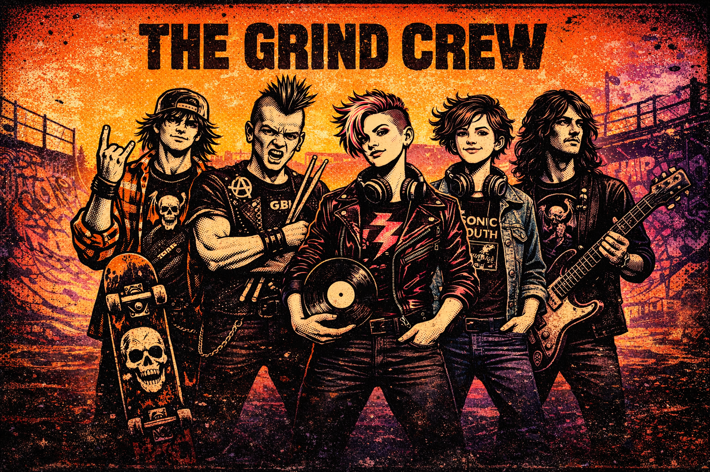
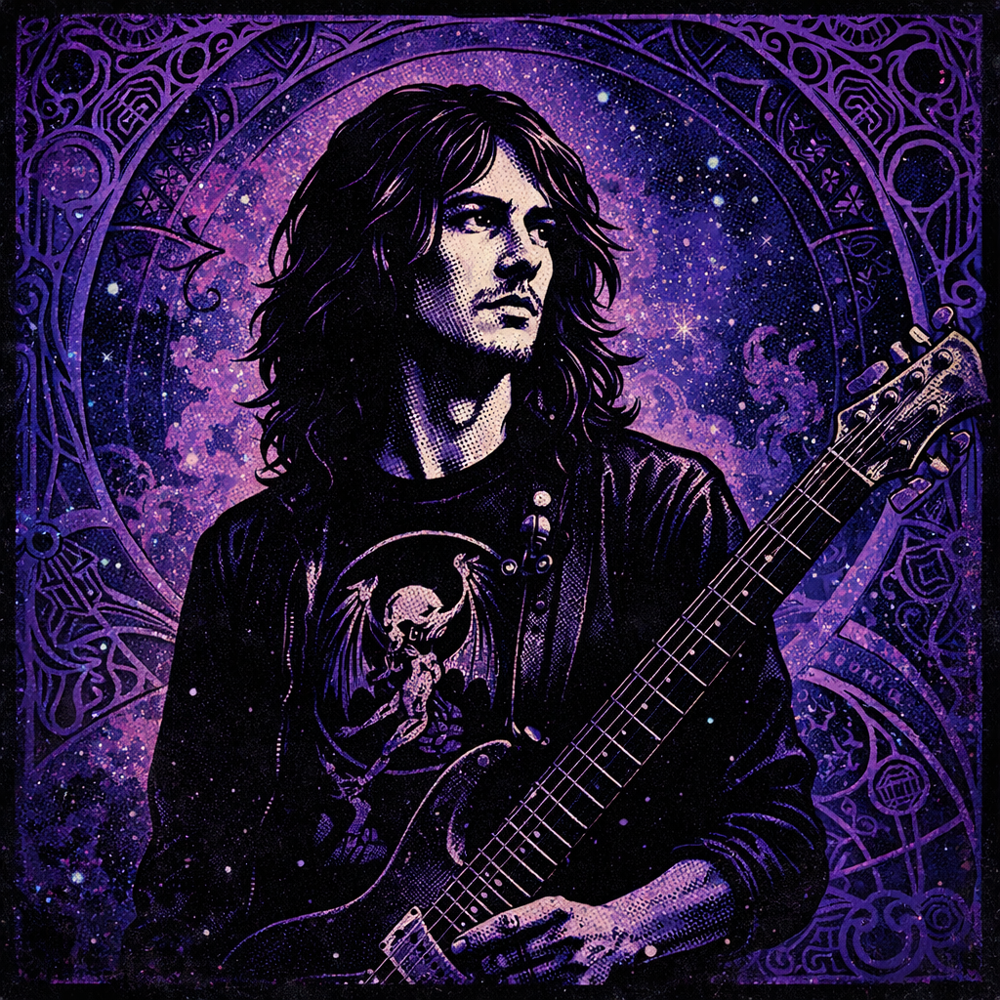

# The Grind Crew 🤘🛹



> A rock & roll development team for [Claude Code](https://docs.anthropic.com/en/docs/claude-code)

The Grind Crew is a multi-agent development team that brings personality and specialized expertise to your coding workflow. Five specialists who treat coding like shredding - with passion, precision, and a whole lot of craft beer.

## What Is This?

This is a **Claude Code agent team** - a collection of specialized AI personas that work together to handle different aspects of software development. Instead of one generic assistant, you get a coordinated crew:

- 📣 **[Duke](./specs/spec-duke.md)** - The orchestrator who routes work to the right specialist
- 🎸 **[Riff](./specs/spec-riff.md)** - Backend architecture and database design
- 💿 **[Verse](./specs/spec-verse.md)** - Frontend UI/UX and components
- 🥁 **[Crash](./specs/spec-crash.md)** - Testing and quality assurance
- 🖊️ **[Ink](./specs/spec-ink.md)** - Documentation and technical writing

Each specialist has their own personality, expertise, and communication style - making development more engaging and ensuring the right skills are applied to each task.

## Quick Start

### Install

```bash
# Clone the repo
git clone https://github.com/yourusername/GrindCrewDevTeam.git
cd GrindCrewDevTeam

# Install to your current project (local)
./installs/install-grindcrew.sh

# OR install globally for all projects
./installs/install-grindcrew.sh -g
```

### Use

```bash
# In Claude Code, start a session with the crew
/grind

# Or talk directly to specialists
@duke    # Routes your request to the right person
@riff    # Backend, APIs, databases, architecture
@verse   # Frontend, UI/UX, Vue components, Tailwind
@crash   # Testing, QA, bug hunting, edge cases
@ink     # Documentation, READMEs, guides
```

### Uninstall

```bash
# Remove from current project
./installs/uninstall-grindcrew.sh

# Remove global installation
./installs/uninstall-grindcrew.sh -g
```

## The Team

| | Specialist | Role | Vibe | Model |
|:--:|------------|------|------|-------|
|  | **[Duke](./specs/spec-duke.md)** | Orchestrator | Tenacious D energy, coordinates the band | Sonnet |
|  | **[Riff](./specs/spec-riff.md)** | Backend/Architecture | Prog-rock deep thinker, builds foundations | Opus |
|  | **[Verse](./specs/spec-verse.md)** | Frontend/UI | Indie rock curator, makes things beautiful | Sonnet |
|  | **[Crash](./specs/spec-crash.md)** | Testing/QA | Punk rock destroyer, breaks things before users do | Sonnet |
|  | **[Ink](./specs/spec-ink.md)** | Documentation | P!nk energy, writes for humans | Sonnet |

### How It Works

```
You → Duke → Specialist(s) → Result
```

1. You make a request (via `/grind` or `@duke`)
2. Duke analyzes and routes to the right specialist(s)
3. Specialists execute their domain expertise
4. Duke synthesizes and delivers the result

For complex projects, Duke coordinates multiple specialists in parallel.

## File Structure

```
GrindCrewDevTeam/
├── README.md                    # You are here
├── THE-GRIND-CREW.md           # Full team documentation
├── agents/                      # Claude Code agent definitions
│   ├── duke.md
│   ├── riff.md
│   ├── verse.md
│   ├── crash.md
│   └── ink.md
├── specs/                       # Detailed character specifications
│   ├── spec-duke.md
│   ├── spec-riff.md
│   ├── spec-verse.md
│   ├── spec-crash.md
│   └── spec-ink.md
└── installs/
    ├── install-grindcrew.sh    # Install script
    └── uninstall-grindcrew.sh  # Uninstall script
```

## Documentation

- **[THE-GRIND-CREW.md](./THE-GRIND-CREW.md)** - Complete team overview, routing matrix, and usage guide
- **[specs/](./specs/)** - Detailed personality and expertise specs for each team member
- **[agents/](./agents/)** - Claude Code agent definition files

## Installation Options

| Flag | Description |
|------|-------------|
| *(none)* | Install to `./.claude/` in current directory |
| `-g, --global` | Install to `~/.claude/` for all projects |
| `-h, --help` | Show help message |

### What Gets Installed

```
~/.claude/ (or ./.claude/)
├── grindcrew/
│   └── personas/          # Character personality files
│       ├── duke.md
│       ├── riff.md
│       ├── verse.md
│       ├── crash.md
│       └── ink.md
├── agents/                # Agent definitions (merged with existing)
│   ├── duke.md
│   ├── riff.md
│   ├── verse.md
│   ├── crash.md
│   └── ink.md
└── commands/              # Slash commands
    └── grind.md
```

## Requirements

- [Claude Code](https://docs.anthropic.com/en/docs/claude-code) CLI installed
- Bash shell (macOS, Linux, or WSL on Windows)

## Philosophy

The Grind Crew believes in:

- **Personality matters** - Engaging personas make development more enjoyable
- **Specialization** - Each team member excels in their domain
- **Parallel execution** - Independent work runs simultaneously
- **Quality at every stage** - From architecture to documentation
- **Having fun** - Work should rock 🤘

## Contributing

Found a bug? Want to add a new team member? PRs welcome!

## License

MIT - Do whatever you want, just don't blame us if Crash breaks your tests.

---

*"We're not just writing code, we're composing a symphony."* - Duke

Let's shred! 🤘🛹🍺
