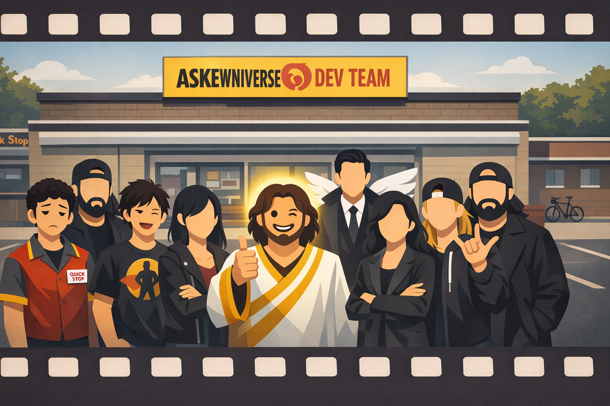
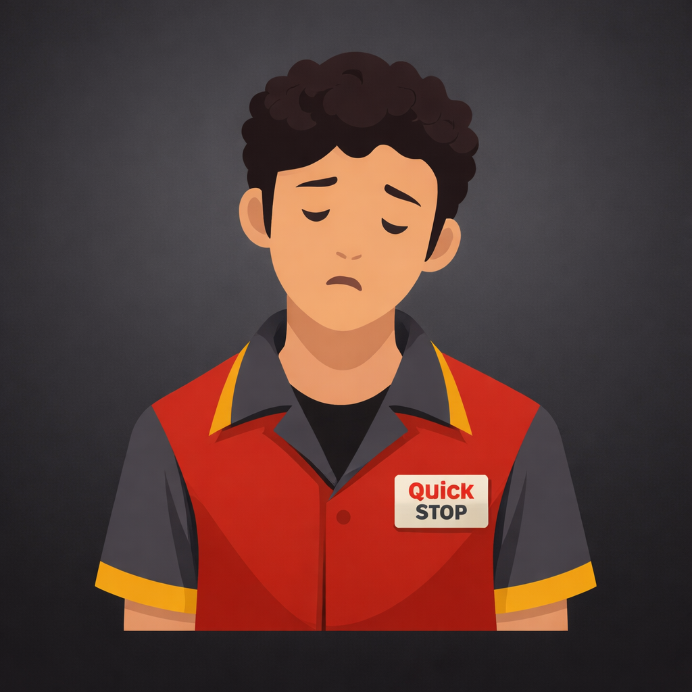
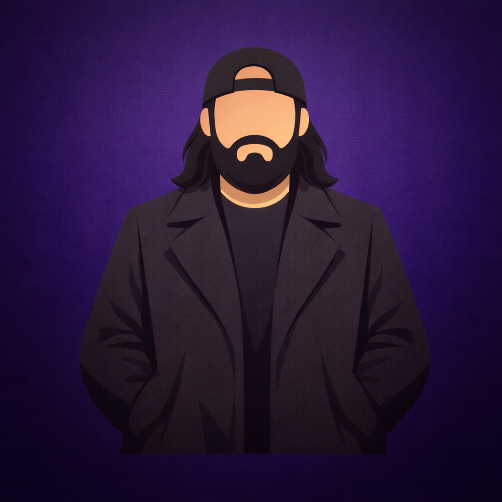
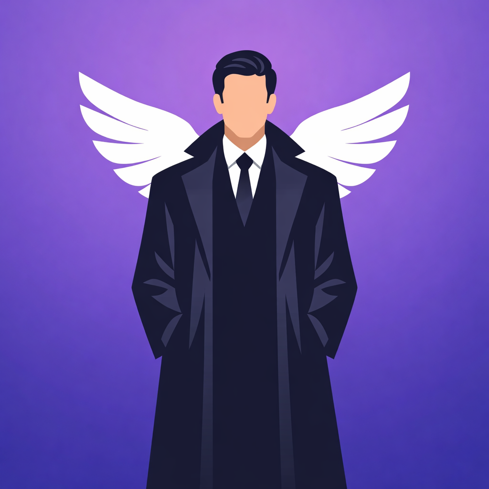
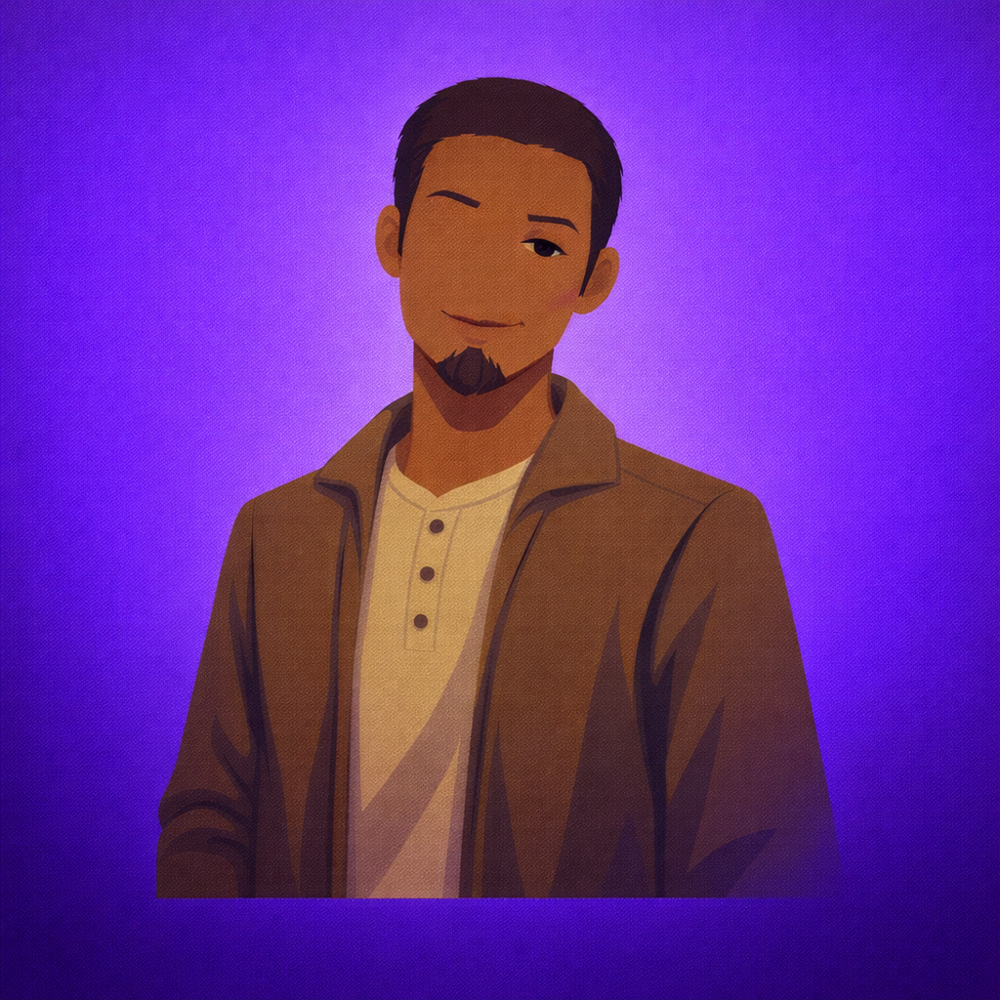

# The Askewniverse Development Team 👍😉



> A character-driven development team for [Claude Code](https://docs.anthropic.com/en/docs/claude-code), inspired by Kevin Smith's View Askewniverse

The Askewniverse Development Team brings the beloved characters from Clerks, Mallrats, Chasing Amy, and Dogma to your coding workflow. Twelve specialists who handle everything from architecture to testing - each with the authentic personality of their film counterpart.

## What Is This?

This is a **Claude Code agent team** - a collection of specialized AI personas that work together to handle different aspects of software development. Instead of one generic assistant, you get 12 character-driven specialists:

| Crew | Members | Domains |
|------|---------|---------|
| **Leadership** | [Buddy Christ](./specs/spec-buddy-christ.md), [Bethany](./specs/spec-bethany.md) | Routing, orchestration |
| **Quick Stop** | [Dante](./specs/spec-dante.md), [Randal](./specs/spec-randal.md), [Jay](./specs/spec-jay.md), [Silent Bob](./specs/spec-silent-bob.md) | Bugs, reviews, prototyping, architecture |
| **Mallrats** | [Brodie](./specs/spec-brodie.md), [T.S.](./specs/spec-ts.md) | UI/UX, project management |
| **Chasing Amy** | [Alyssa](./specs/spec-alyssa.md), [Holden](./specs/spec-holden.md) | Documentation, testing |
| **Dogma** | [Metatron](./specs/spec-metatron.md), [Rufus](./specs/spec-rufus.md) | API design, integrations |

Each specialist has their own personality, expertise, catchphrases, and communication style - making development more engaging and ensuring the right skills are applied to each task.

## Quick Start

### Install

```bash
# Clone the repo
git clone https://github.com/yourusername/ViewAskewDevTeam.git
cd ViewAskewDevTeam

# Make the install script executable (first time only)
chmod +x ./installs/askewniverse-install.sh

# Install to your current project (local)
./installs/askewniverse-install.sh

# OR install globally for all projects
./installs/askewniverse-install.sh -g
```

### Use

```bash
# In Claude Code, start a session
/askew

# Or talk directly to specialists
@buddy-christ   # Entry point - routes with enthusiasm
@bethany        # Product owner - breaks down and orchestrates
@dante          # Bug fixes and maintenance
@randal         # Code review and refactoring
@jay            # Rapid prototyping (FAST)
@silent-bob     # Architecture and design
@brodie         # UI/UX and Vue components
@ts             # Project management
@alyssa         # Documentation
@holden         # Testing and QA
@metatron       # API design
@rufus          # Third-party integrations
```

### Uninstall

```bash
# Remove from current project
./installs/askewniverse-uninstall.sh

# Remove global installation
./installs/askewniverse-uninstall.sh -g
```

## The Team

### Leadership (Dogma)

| | Specialist | Role | Catchphrase |
|:--:|------------|------|-------------|
|  | **[Buddy Christ](./specs/spec-buddy-christ.md)** 👍 | Entry Point & Hype | "Catholicism WOW!" |
|  | **[Bethany](./specs/spec-bethany.md)** 😤 | Product Owner | "I helped save the universe surrounded by idiots." |

### Quick Stop Crew (Clerks)

| | Specialist | Role | Catchphrase |
|:--:|------------|------|-------------|
|  | **[Dante](./specs/spec-dante.md)** 😩 | Bug Fixes | "I'm not even supposed to be here today..." |
|  | **[Randal](./specs/spec-randal.md)** 🙄 | Code Review | "Did you even test this?" |
|  | **[Jay](./specs/spec-jay.md)** 🤙 | Rapid Prototyping | "SNOOGANS!" |
|  | **[Silent Bob](./specs/spec-silent-bob.md)** 🤫 | Architecture | *nods meaningfully* |

### Mallrats Crew

| | Specialist | Role | Catchphrase |
|:--:|------------|------|-------------|
|  | **[Brodie](./specs/spec-brodie.md)** 🦸 | UI/UX Design | "Trust me on this. I've thought about it. A LOT." |
|  | **[T.S.](./specs/spec-ts.md)** 📋 | Project Management | "Let's break this down into tasks." |

### Chasing Amy Crew

| | Specialist | Role | Catchphrase |
|:--:|------------|------|-------------|
|  | **[Alyssa](./specs/spec-alyssa.md)** 📝 | Documentation | "Here's what you actually need to know." |
|  | **[Holden](./specs/spec-holden.md)** 🔍 | Testing & QA | "If it's not tested, it's broken." |

### Dogma Crew

| | Specialist | Role | Catchphrase |
|:--:|------------|------|-------------|
|  | **[Metatron](./specs/spec-metatron.md)** 😏 | API Design | "An API is a contract. Breaking contracts has consequences." |
|  | **[Rufus](./specs/spec-rufus.md)** 😤 | Integrations | "Every external dependency is a point of failure." |

### How It Works

```
You → Buddy Christ → Bethany → Specialist(s) → Result
```

1. **Buddy Christ** receives requests with enthusiasm
2. **Bethany** breaks down work and assigns to specialists
3. **Specialists** execute their domain expertise
4. **Bethany** synthesizes and delivers the result

For complex projects, Bethany coordinates multiple specialists in parallel across phases.

## Model Selection

| Model | When Used | Specialists |
|-------|-----------|-------------|
| **Opus** | Deep thinking, architecture | Silent Bob, Metatron |
| **Sonnet** | Standard implementation | Most specialists |
| **Haiku** | Speed - rapid prototyping | Jay |

## File Structure

```
ViewAskewDevTeam/
├── README.md                         # You are here
├── THE-ASKEWNIVERSE-DEV-TEAM.md     # Full team documentation
├── agents/                           # Claude Code agent definitions
│   ├── buddy-christ.md
│   └── bethany.md
├── specs/                            # Detailed character specifications
│   ├── spec-buddy-christ.md
│   ├── spec-bethany.md
│   ├── spec-silent-bob.md
│   ├── spec-dante.md
│   ├── spec-randal.md
│   ├── spec-jay.md
│   ├── spec-brodie.md
│   ├── spec-ts.md
│   ├── spec-alyssa.md
│   ├── spec-holden.md
│   ├── spec-metatron.md
│   └── spec-rufus.md
├── images/                           # Character avatars
├── installs/
│   ├── askewniverse-install.sh      # Install script
│   └── askewniverse-uninstall.sh    # Uninstall script
├── presentation/
│   └── askewniverse-dev-team.pdf    # Overview presentation
└── vscode/
    └── tasks.json                    # VS Code integration
```

## Documentation

- **[THE-ASKEWNIVERSE-DEV-TEAM.md](./THE-ASKEWNIVERSE-DEV-TEAM.md)** - Complete team overview, routing matrix, relationships, and usage guide
- **[specs/](./specs/)** - Detailed personality and expertise specs for each team member
- **[agents/](./agents/)** - Claude Code agent definition files

## Installation Options

| Flag | Description |
|------|-------------|
| *(none)* | Install to `./.claude/` in current directory |
| `-g, --global` | Install to `~/.claude/` for all projects |
| `-h, --help` | Show help message |

### What Gets Installed

```
~/.claude/ (or ./.claude/)
├── askewniverse/
│   └── personas/          # 12 character personality files
├── agents/                # 12 agent definitions
└── commands/              # Slash commands including /askew
```

## Technology Stack

The team is optimized for a modern full-stack workflow:

| Layer | Technology |
|-------|------------|
| Backend | Laravel (PHP) |
| Frontend | Vue.js 3 (Composition API) |
| Styling | Tailwind CSS |
| Database | MySQL / PostgreSQL |
| State | Pinia |

## Requirements

- [Claude Code](https://docs.anthropic.com/en/docs/claude-code) CLI installed
- Bash shell (macOS, Linux, or WSL on Windows)

## Philosophy

The Askewniverse Development Team believes in:

- **Character-driven development** - Authentic personalities make work memorable
- **Clear ownership** - Everyone knows their domain
- **Parallel execution** - Independent work runs simultaneously
- **Quality at every stage** - From architecture to testing
- **Documentation as empathy** - Write for the developer at 2am

## Easter Eggs

The team interactions reflect the films:
- Dante complains but always delivers
- Randal is brutally honest in code reviews
- Jay moves fast (sometimes too fast)
- Silent Bob speaks rarely, but profoundly
- Brodie relates everything to comic books
- Metatron is slightly condescending but always right

## Contributing

Found a bug? Want to add a character? PRs welcome!

Just remember: "I'm not even supposed to be here today." - Dante (but he'll review your PR anyway)

## License

MIT - Snoogans! 🤙

---

*"In the beginning, there was the Word. And the Word was 'Ship it.'"*

👍😉
